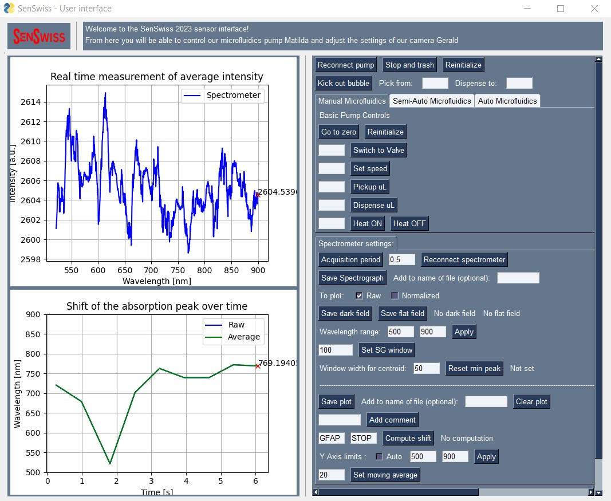

# Graphical user interface (GUI) repository of the 2023 SenSwiss Team

**Table of content:**
- [Graphical user interface (GUI) repository of the 2023 SenSwiss Team](#graphical-user-interface-gui-repository-of-the-2023-senswiss-team)
  - [Structure](#structure)
  - [Installation](#installation)
  - [Description](#description)
    - [Interface](#interface)
    - [Microfluidic system](#microfluidic-system)
    - [Camera](#camera)
    - [Spectrometer](#spectrometer)
    - [Arduino \& DC motor](#arduino--dc-motor)
    - [Protocols](#protocols)
  - [Usage](#usage)
  - [Results](#results)
  - [Authors](#authors)

<a id="Structure"></a>
## Structure
The GUI repository of the 2023 SenSwiss Team is organized as follows:
- `image_saved`: stores the images taken by the camera or the spectrographs taken by the spectrometer during the experiments.
- `layout_figures`: contains the figures used in the GUI
- `plots_saved`: stores the data plots generated by the GUI
- `protocols`: store the protocols used for the experiments, these protocols can be defined and directly loaded in the GUI
- **arduino_control.py**: contains the code to control the Arduino board
- **control_flir_camera.py**: contains the code to control the camera
- **gui.py**: contains the code of the GUI
- **imgproc.py**: contains the main functions to process the images taken by the camera and the spectrographs taken by the spectrometer
- **layout.py**: contains the code to define the layout of the GUI
- **microflu.py**: contains the code to control the microfluidic system

<a id="Installation"></a>
## Installation
To run the code, you will need to install several packages. The easiest way to do so is to use the Anaconda distribution. You can download it [here](https://www.anaconda.com/products/individual). Once Anaconda is installed, you can create a new environment and install the packages using the following commands in the Anaconda prompt:
```
conda create -n senswiss python=3.10
conda activate senswiss
```
Then, you can install the packages using the following commands:
```
pip install name_of_the_library
```

<a id="Description"></a>
## Description
This miniprogram allow the user to control the different systems of the sensor and to perform the experiments. The GUI can be used in two modes: with a camera or with a spectrometer, depending on which measurement is better suited for the experiment. The GUI will then automatically adapt the interface to the pluged in measurement device.

The GUI is divided into 3 parts:
- **Microfluidics** which controls the pump
- **Measurement device** which controls either the camera or the spectrometer depending on which is pluged in, and procresses the signal to obtain a signal over time
- **Motor control** which controls the DC motor to open or close the measurement chamber


<a id="Interface"></a>
### Interface
The GUI is presented as follows, with on the left, the image/spectrograph and the signal over time, and on the right, the control buttons and the parameters to set.

<a id="Microfluidic-system"></a>
### Microfluidic system
The microfluidic section contains all buttons to control the integrated pump system ([AMF LSPone](https://amf.ch/produit/lspone-laboratory-syringe-pump/)). The pump is a 12 valves microfluidic system that allows to pick and dispense a volume of 8-250 mL at a flowrate of 25-7'500 $\mu L$/min.


<a id="Camera"></a>
### Camera
GUI in camera mode:


On the top left, the real time image of the camera ([FLIR Blackfly S USB3](https://www.flir.fr/products/blackfly-s-usb3/?vertical=machine%20vision&segment=iis))is displayed.

In the command pannel on the right, in the section `Camera settings`, the user can set different parameters to improve the signal reading and control the camera. The program enables the extraction of a Region Of Interest (ROI) from the camera image, via intensity threshold filtering. The user can set the parameter for the detection of the ROI by changing the `Kernel size`, the `Number of dilations` and the `Threshold value`. The program will then apply a gaussian smoothing (of empirical size (15,15)), compute a threshold mask from the smoothed image, dilate the mask a certain number of times with the squared kernel and determine the ROI as the centroid of the mask image (via the `cv2.moments` function). The ROI is then displayed on the camera image (top left). It can also be set manually by the user by clicking on the camera image. The ROI's shape (rectangular or cicular) and shape's parameters can be set by the user via the appropriate drop-down list or input fields.

The ROI is then used to compute the signal by simply averaging the intensity over the ROI surface. This signal is then displayed overtime in relative 8 bits intensity pixel level unit on the bottom left window.

The user can also set specific camera parameters such as the `Exposure time` and the `Gain` via the appropriate input fields. These parameters vary the intensity of the signal (the higher the exposure time and the gain, the higher the intensity of the signal).

The user can save a picture of the camera image by clicking on the `Save image` button. The image will be saved in the `image_saved` folder as a **.png** file. The user can name the image file via the adjacent input field, in any case, the image will be saved with the current date and time.

Finally, the user can fine tune the display of the processed signal by setting y-axis limits via the appropriate input fields (min and max), or can chose to set these values automatically by clicking on the `Auto` checkbox, the program will then automatically set the y-axis limits to the minimum and maximum values of the signal. The plot of the signal overtime can be saved via the `Save plot` button. The plot will be saved in the `plots_saved` folder as a **.csv** file. The user can name the plot file via the adjacent input field, in any case, the plot will be saved with the current date and time.

The original idea was to use the intensity of the optical signal measured by a camera to detect the concentration of the sample. However, this method was found to be not sensitive enough. Hence, we decided to rely on the wavelenght shift, measured by a spectrometer to detect the concentration of the sample.

<a id="Spectrometer"></a>
### Spectrometer
GUI in spectrometer mode:


On the top left, the real time spectrograph of the spectrometer ([MAYA 2000 PRO](https://www.gmp.ch/spectroscopy/spectrometer/high-sensitivity-uv-spectrometers-maya))is displayed.

In the command pannel on the right, in the section `Spectrometer settings`, the user can set different parameters to improve the signal reading and control the spectrometer.

The sampling period of the spectrometer signal can be set via the button `Acquisition period`. By default the sampling period is at 0.5 sec which is a good compromise between the signal quality and the computational cost.

In case the spectrometer gets unpluged, the user can reconnect the spectrometer via the `Reconnect spectrometer` button. The program will then automatically detect the spectrometer and connect to it.

The signal of the spectrometer (intensity spectrum along wavelengths from 500 to 900 nm) is process via the following normalization step:

$$normalized\ intensity\ spectrum = \frac{intensity\ spectrum\ -\ dark\ field}{flat\ field \ -\ dark\ field}  \ normalize\ gain$$

Where the **intensity spectrum** (`intensities_spec`) is the raw signal from the spectrometer, the **dark field** (`dark_field`) is the signal of the spectrometer when the light source is off, the **flat field** (`flat_field`) is the signal of the spectrometer when the light source is on and the polarizer is at 90° from its reference angle for the true measurements (the user has to manually set the polarizer at 90° to save the flat field), and the **normalize gain** (`normalize_gain`) is a constant computed as the mean value of the difference between the flat and dark fields (flat field - dark field). 
The dark field and the flat field are to be measured at the beginning of the experiment via the appropriate buttons and are stored in memory for the entire experiment. The flat field corresponds to the optical signal as if the target (sample and chip) acted as a perfect mirror. This normalization allows to get rid of the background signal and improves the sensitivity. The normalized spectrum is then displayed in relative intensity level unit on the top left window. The user can save the spectrograph by clicking on the `Save spectrograph` button. The spectrograph will be saved in the `image_saved` folder as a **.png** file. The user can name the spectrograph file via the adjacent input field, in any case, the spectrograph will be saved with the current date and time.

The idea of the measurement by spectrometry is to make use of the absorption peak shift in function of the sample concentration at the surface of the chip, thanks to the high signal enhancement effect of [surface plasmon resonance](https://en.wikipedia.org/wiki/Surface_plasmon_resonance). The absorption peak is detected by computing the minimum of the normalized spectrum. This signal is then displayed overtime on the bottom left window. As a good signal-to-noise ratio is crucial for optimal detection, different denoising methods have been implemented to improve the signal quality.

Firstly, we implemented a simple moving average filter. This denoising method proved not to be effective enough. Hence a Savitzy-Golay filter was added to smooth the intensities signal before normalizing. The window can be chosen by the user via the `Set SG window` and its adjacent input field. The filtered signal is also plotted on the bottom left window.

Having found the previous method ineffective, we implemented a last denoising filter. This involves calculating the centroid of the signal in a fixed wavelenghts window set by the user at the begining of the experiment during calibration. 


################################

Vertical lines are incorporated at the times of comments, enhancing its utility as a tool for visualizing data and comment annotations. The code for this can be found in the file `plotCentroids.py`.


<a id="Arduino-&-DC-motor"></a>
### Arduino & DC motor


<a id="Protocols"></a>
### Protocols

The Software team's responsibilities included conducting various experiments with the biosensor, testing different protocols, and archiving the results. 

During experiments, protocols can be inputted directly into the User Interface and saved in the 'protocols' folder. These protocols are stored in .csv files, making it possible to conveniently reload them in the GUI for future experiments, ultimately saving time. 

<a id="Usage"></a>
## Usage
To run the GUI, you can use the following command in the Anaconda prompt after activating the environment:
```
python gui.py
```
Be sure to check that the necessary devices (camera/spectrometer, pump, arduino) are connected to the computer before running the GUI.

<a id="Results"></a>
## Results


The initial plan involved fitting the segments of the signal with an exponential function after applying GFAP. The intention was to save the parameters of the exponential function for each segment and utilize them to train a Machine Learning model for predicting the concentration of the sample under examination. This approach required a substantial amount of data to be collected. Unfortunately, due to the challenges faced by the SenSwiss team in 2023, this data collection could not be accomplished. Nevertheless, the functions for fitting the exponential functions are stored in 'imgproc.py' and remain available for use by future teams.

The classification of each sample (from Very Low to Very High Concentration) was hence computed by fitting two linear regression curves. 


<a id="Authors"></a>
## Authors
- [**Marin Bricq**](https://github.com/MBricq)
- [**Arthur Eglin**](https://github.com/ArthurEglin)
- [**Elena Gado**](https://github.com/ElenaGrazia)